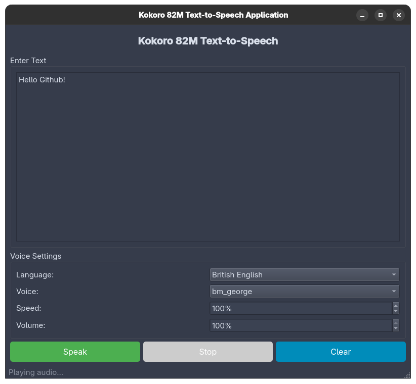

# vibe-tts

A desktop Text-to-Speech application powered by Kokoro 82M, providing high-quality voice synthesis through an intuitive PyQt6 interface.



## Features

- **User-Friendly GUI**: Clean PyQt6 interface for easy text-to-speech conversion
- **Kokoro 82M Integration**: Lightweight yet powerful TTS model with 82 million parameters
- **Multi-Language Support**: Support for 9 languages including English, Spanish, French, Hindi, Italian, Japanese, Portuguese, and Chinese
- **Multiple Voices**: Wide variety of male and female voices for each language
- **Customizable Speech**: Adjustable speed (50% - 200%) and volume control
- **Real-time Playback**: Instant audio playback with stop functionality
- **Responsive Design**: Threaded architecture keeps the UI responsive during synthesis
- **Local Processing**: Runs entirely on your machine without requiring external servers

## Prerequisites

### For Running the Application

- Python 3.12
- PyTorch (CPU or GPU support)
- No external server required - runs locally!

## Installation

1. Clone the repository:

```bash
git clone https://github.com/yourusername/vibe-tts.git
cd vibe-tts
```

2. Install dependencies using uv:

```bash
uv sync
```

## Usage

1. Launch the application:

```bash
uv run python tts_app.py
```

2. In the application:
   - Enter or paste text in the text area
   - Select language from the dropdown
   - Choose a voice for the selected language
   - Adjust speed (50% - 200%) and volume as needed
   - Click "Speak" to synthesize and play audio
   - Use "Stop" to halt playback

## Configuration

### Supported Languages

- American English
- British English
- Spanish
- French
- Hindi
- Italian
- Japanese (requires `uv add misaki[ja]`)
- Brazilian Portuguese
- Mandarin Chinese (requires `uv add misaki[zh]`)

### Voice Examples

- **American English**: af_heart, af_bella, am_adam, am_michael
- **British English**: bf_emma, bf_isabella, bm_george, bm_lewis
- **Spanish**: ef_sofia, em_carlos
- **French**: ff_camille, fm_pierre
- And many more for each language!

## Project Structure

```
vibe-tts/
- tts_app.py              # Main application with GUI and Riva integration
- main.py                 # Application entry point
- pyproject.toml          # Project dependencies and metadata
- README.md               # This file
- README_RIVA_SETUP.md    # Detailed Riva server setup guide
- riva_quickstart_v2.19.0/  # Riva setup scripts and configuration
```

## Development

### Running Tests

```bash
uv run pytest
```

### Code Formatting

```bash
uv run ruff format .
uv run ruff check . --fix
```

### Type Checking

```bash
uv run pyright
```

## Troubleshooting

### Installation Issues

- If you encounter errors with PyTorch, install it manually based on your system:
  - CPU: `uv add torch --index-url https://download.pytorch.org/whl/cpu`
  - CUDA: `uv add torch --index-url https://download.pytorch.org/whl/cu121`

### Audio Issues

- Verify system audio is working
- Check volume settings in both the app and system
- Ensure soundfile is properly installed: `uv add soundfile`

### Language-Specific Issues

- For Japanese support: `uv add misaki[ja]`
- For Chinese support: `uv add misaki[zh]`
- Some languages require espeak-ng: `sudo apt-get install espeak-ng` (Linux/WSL)

### Performance

- GPU acceleration is supported automatically if CUDA is available
- For Apple Silicon Macs: The app will use MPS acceleration automatically
- First run may be slower as models are downloaded and cached

## Contributing

1. Fork the repository
2. Create a feature branch: `git checkout -b feature-name`
3. Make your changes following the guidelines in [CLAUDE.md](CLAUDE.md)
4. Run tests and formatters
5. Commit your changes
6. Push to your fork and submit a pull request

## License

This project is licensed under the MIT License. See the [LICENSE](LICENSE) file for details.

## MIT License

```
MIT License

Copyright (c) 2024 [Your Name or Organization]

Permission is hereby granted, free of charge, to any person obtaining a copy
of this software and associated documentation files (the "Software"), to deal
in the Software without restriction, including without limitation the rights
to use, copy, modify, merge, publish, distribute, sublicense, and/or sell
copies of the Software, and to permit persons to whom the Software is
furnished to do so, subject to the following conditions:

The above copyright notice and this permission notice shall be included in all
copies or substantial portions of the Software.

THE SOFTWARE IS PROVIDED "AS IS", WITHOUT WARRANTY OF ANY KIND, EXPRESS OR
IMPLIED, INCLUDING BUT NOT LIMITED TO THE WARRANTIES OF MERCHANTABILITY,
FITNESS FOR A PARTICULAR PURPOSE AND NONINFRINGEMENT. IN NO EVENT SHALL THE
AUTHORS OR COPYRIGHT HOLDERS BE LIABLE FOR ANY CLAIM, DAMAGES OR OTHER
LIABILITY, WHETHER IN AN ACTION OF CONTRACT, TORT OR OTHERWISE, ARISING FROM,
OUT OF OR IN CONNECTION WITH THE SOFTWARE OR THE USE OR OTHER DEALINGS IN THE
SOFTWARE.
```

## Acknowledgments

- Built with [Kokoro 82M](https://huggingface.co/hexgrad/Kokoro-82M) by Hexgrad
- UI powered by [PyQt6](https://www.riverbankcomputing.com/software/pyqt/)
